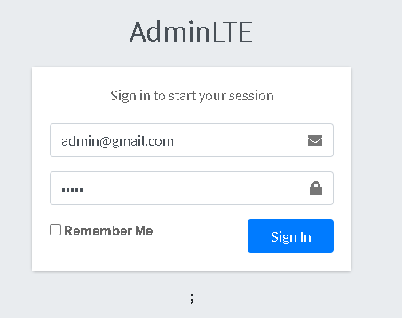

# Laravel RBAC Demo 
Using AdminLTE and laravel-permission by spatie

## Default Users
| No | Username             | Password   | Role       |
|----|----------------------|------------|------------|
| 1  | admin@gmail.com      | admin      | Admin      |
| 2  | supervisor@gmail.com | supervisor | Supervisor |
| 3  | staff@gmail.com      | staff      | Staff      |

## Getting Started

 1. Clone [https://github.com/dimaspriyo/go-elk-logging](https://github.com/dimaspriyo/go-elk-logging)
 2. Run **composer install**
 3. Migrate database
 **php artisan migrate**
 4. Seed database
  **php artisan db:seed**
 
 ## Screenshoots
 
